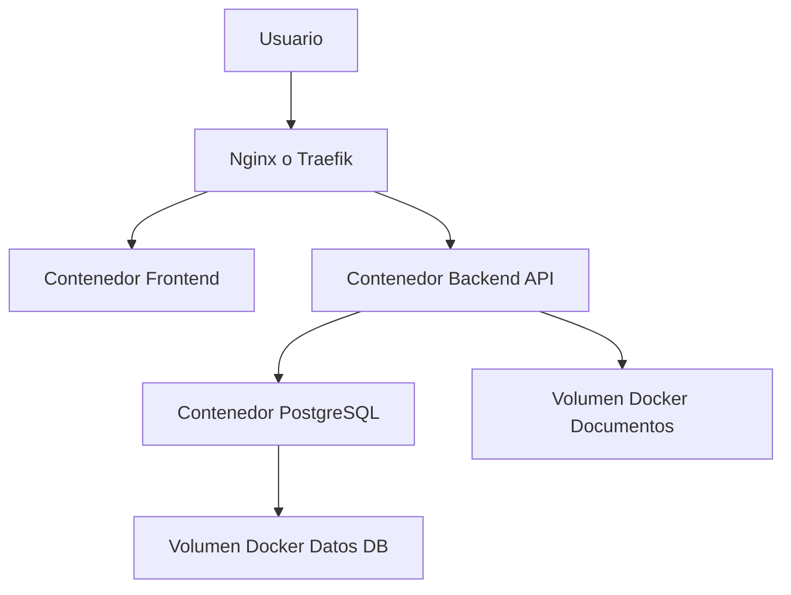
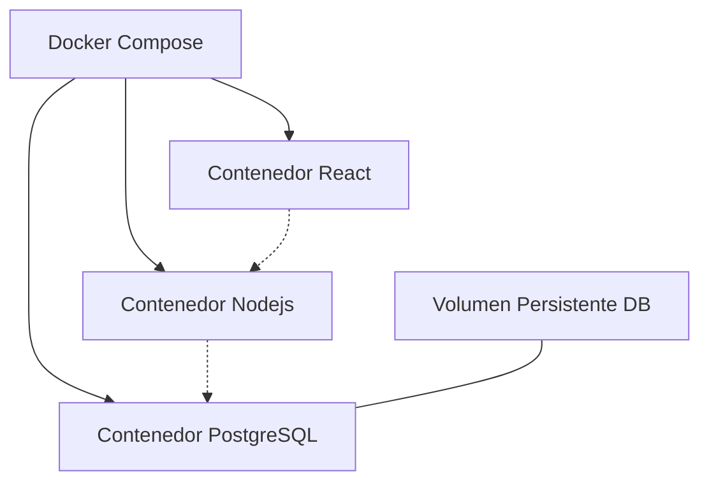

Rol: Eres un Desarrollador Full-Stack Senior y Arquitecto de Software. Tu objetivo es codificar una aplicación de gestión de proyectos a medida.

Contexto del Negocio:
El sistema será utilizado para gestionar proyectos de desarrollo y consultoría para múltiples clientes corporativos. Es absolutamente crítico el registro exacto del tiempo invertido en cada tarea para poder gestionar presupuestos, justificar el cobro de honorarios y contabilizar horas extra de forma transparente. Además, la plataforma debe permitir la colaboración fluida y en tiempo real con otros ingenieros del equipo, como Igor, asegurando que todos vean el mismo estado del proyecto sin recargar la página.

Stack Tecnológico Requerido:

Infraestructura: Docker y Docker Compose para desarrollo local fluido en WSL y futuro despliegue en servidor propio.

Frontend: React con Vite.

Backend: Node.js con Express.

Base de Datos: PostgreSQL.

Almacenamiento de Archivos: Volúmenes de Docker localmente, preparándolo para una futura migración a AWS S3.

Requerimientos Funcionales Clave (Core Features):

Gestión de Proyectos y Tareas (Kanban):

Múltiples usuarios deben poder crear proyectos.

Las tareas deben visualizarse en un tablero tipo Kanban con estados personalizables.

Las tareas contienen título, descripción rica en texto, responsable, fecha de vencimiento y documentos adjuntos.

Seguimiento de Tiempo Granular (Time Tracking):

El frontend debe incluir un cronómetro por tarea.

Los registros de tiempo deben guardarse en una tabla independiente en la base de datos relacional vinculando Usuario, Tarea, Hora de Inicio y Hora de Fin.

Se debe permitir la carga y edición manual de tiempos.

Sincronización Bidireccional con Google Calendar:

Implementar flujo OAuth2 para que cada usuario conecte su cuenta.

Al asignar una fecha de vencimiento a una tarea, crear automáticamente el evento en el Google Calendar del usuario asignado.

Implementar webhooks para que, si el usuario modifica el evento en Google Calendar, la fecha de la tarea se actualice en la base de datos.

Colaboración en Tiempo Real:

Implementar WebSockets o Server-Sent Events. Si un usuario mueve una tarjeta de estado, inicia el cronómetro o sube un documento, los demás usuarios viendo el tablero deben ver el cambio reflejado instantáneamente.


# Arquitectura del Sistema



---

# Fase 1: Arquitectura Base y Contenedores (La Fundación)

El objetivo aquí es tener la infraestructura lista para que los tres componentes hablen entre sí.

* Creación del archivo **docker-compose.yml** para orquestar los tres servicios.
* Configuración del contenedor de **PostgreSQL** con volúmenes persistentes para no perder datos si el contenedor se reinicia.
* Configuración de los contenedores **"esqueleto"** para el Frontend y el Backend con recarga en caliente para facilitar el desarrollo.
* Definición de las **variables de entorno** para desarrollo y producción.

---

# Fase 2: Backend Core y Base de Datos (El Motor)

Aquí construimos la lógica principal y el almacenamiento de datos.

* Diseño y ejecución de las **migraciones en PostgreSQL** para las tablas base:

  * Usuarios
  * Proyectos
  * Tareas
* Implementación del sistema de **autenticación y autorización mediante JWT**.
* Desarrollo de los **endpoints RESTful** para el CRUD completo de proyectos y tareas.
* Configuración de **permisos** para asegurar que múltiples usuarios puedan acceder a los tableros correspondientes de forma segura.

---

# Fase 3: Frontend Core (La Cara Visible)

Dar vida a la interfaz con la que interactuarán los usuarios.

* Configuración del **enrutamiento** y la **gestión del estado global** de la aplicación.
* Desarrollo de las **pantallas de login y registro**.
* Creación de la vista de **tablero tipo Kanban**, permitiendo arrastrar y soltar tareas entre columnas.
* Integración del **frontend con la API del backend** construida en la Fase 2.

---

# Fase 4: Tracking de Tiempo y Sincronización en Tiempo Real (La Magia)

Agregamos el valor diferencial a la herramienta.

* Creación de la tabla y endpoints en el backend para **registrar inicios y fines de tiempo por tarea**.
* Desarrollo del **componente visual del cronómetro** en el frontend.
* Implementación de **WebSockets** para sincronización en tiempo real:

  * Si un usuario mueve una tarjeta.
  * Si actualiza tiempo en una tarea.

Todos los usuarios viendo el tablero verán los cambios **instantáneamente**.

---

# Fase 5: Integraciones Complejas (Calendar y Documentos)

Conectamos el sistema con el mundo exterior.

* Implementación del flujo **OAuth2 con Google**.
* Lógica en el backend para **crear, actualizar y eliminar eventos en Google Calendar**.
* Configuración de un **volumen Docker para documentos adjuntos**.
* Creación de endpoints para **subir y descargar archivos**, vinculándolos a tareas.

---

# Fase 6: Preparación para Producción (El Lanzamiento)

Ajustamos todo para producción.

* Configuración de **proxy inverso (Nginx)**.
* Generación de **certificados SSL con Let's Encrypt**.
* Optimización de **imágenes Docker** para frontend y backend.

---

# Detalle de la Fase 1

Vamos a armar la Fase 1 con el nivel de detalle necesario para dejar la base lista hoy mismo.

## Diagrama de Contenedores



---

# 1. Estructura de Directorios

Primero organizamos el proyecto.

```
mi-gestor-proyectos/
├── frontend/           # Aquí vivirá React (sugiero usar Vite)
├── backend/            # Aquí vivirá Node.js + Express
└── docker-compose.yml  # El director de orquesta
```

---

# 2. Dockerfile para el Backend (Node.js)

Archivo: `backend/Dockerfile`

```dockerfile
FROM node:20-alpine

# Directorio de trabajo dentro del contenedor
WORKDIR /app

# Copiamos dependencias
COPY package*.json ./

# Instalamos dependencias
RUN npm install

# Copiamos el código
COPY . .

# Exponemos puerto
EXPOSE 3000

# Modo desarrollo
CMD ["npm", "run", "dev"]
```

---

# 3. Dockerfile para el Frontend (React)

Archivo: `frontend/Dockerfile`

```dockerfile
FROM node:20-alpine

WORKDIR /app

COPY package*.json ./

RUN npm install

COPY . .

# Puerto de Vite
EXPOSE 5173

CMD ["npm", "run", "dev", "--", "--host"]
```

---

# 4. docker-compose.yml

Archivo en la raíz del proyecto.

```yaml
version: '3.8'

services:

  db:
    image: postgres:15-alpine
    container_name: gestor_db
    environment:
      POSTGRES_USER: admin
      POSTGRES_PASSWORD: secretpassword
      POSTGRES_DB: gestor_proyectos_db
    ports:
      - "5432:5432"
    volumes:
      - pgdata:/var/lib/postgresql/data
    restart: unless-stopped

  backend:
    build:
      context: ./backend
    container_name: gestor_backend
    ports:
      - "3000:3000"
    volumes:
      - ./backend:/app
      - /app/node_modules
    environment:
      - PORT=3000
      - DATABASE_URL=postgres://admin:secretpassword@db:5432/gestor_proyectos_db
    depends_on:
      - db
    restart: unless-stopped

  frontend:
    build:
      context: ./frontend
    container_name: gestor_frontend
    ports:
      - "5173:5173"
    volumes:
      - ./frontend:/app
      - /app/node_modules
    environment:
      - VITE_API_URL=http://localhost:3000
    depends_on:
      - backend
    restart: unless-stopped

volumes:
  pgdata:
```

---

# Troubleshooting (Errores Comunes)

## Error: Port already in use

**Causa**

Ya existe un servicio usando:

* 5432
* 3000
* 5173

**Solución**

Cambiar el puerto:

```yaml
"5433:5432"
```

o apagar el servicio local.

---

## Hot Reload no funciona

### En Vite

Editar `vite.config.js`

```javascript
server: {
  watch: {
    usePolling: true
  }
}
```

### En Node (nodemon)

```bash
nodemon -L index.js
```

---

## Error de conexión a PostgreSQL

**Causa**

El backend intenta conectarse antes de que la base esté lista.

**Solución**

Implementar **reintentos de conexión** en el backend antes de iniciar la aplicación.

---

## Problemas con node_modules

**Causa**

Conflictos entre dependencias locales y del contenedor.

**Solución**

Usar volumen anónimo:

```yaml
- /app/node_modules
```

Esto **aísla las dependencias del contenedor** de las de la máquina host.

