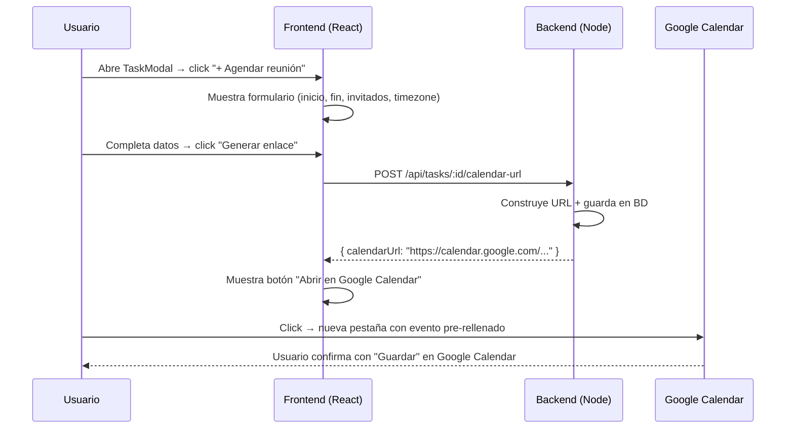

# Walkthrough: Integración Google Calendar vía URL

## Cambios realizados

### Backend (3 archivos)

#### [Task.js](file:///h:/desarrollos/mi-gestor-proyectos/backend/src/models/Task.js)
Nuevo campo `calendarUrl` (TEXT, nullable) para persistir la última URL de evento generada.

#### [taskController.js](file:///h:/desarrollos/mi-gestor-proyectos/backend/src/controllers/taskController.js)
Nueva función [generateCalendarUrl](file:///h:/desarrollos/mi-gestor-proyectos/backend/src/controllers/taskController.js#162-225) que:
1. Recibe `{ startDateTime, endDateTime, attendees[], timezone }`
2. Construye la URL de Google Calendar con `URLSearchParams`
3. Formatea las fechas a `YYYYMMDDTHHMMSSZ` (UTC)
4. Incluye el nombre del proyecto como `location` y en `details`
5. Agrega los emails de invitados como parámetros `add=...`
6. Persiste la URL en `task.calendarUrl` via Sequelize
7. Retorna `{ calendarUrl }` al cliente

#### [tasks.js (routes)](file:///h:/desarrollos/mi-gestor-proyectos/backend/src/routes/tasks.js)
Nueva ruta: `POST /api/tasks/:taskId/calendar-url` (protegida por JWT middleware `auth`).

### Frontend (1 archivo)

#### [TaskModal.jsx](file:///h:/desarrollos/mi-gestor-proyectos/frontend/src/components/TaskModal.jsx)
Nueva sección **"📅 Google Calendar"** con 3 estados:

| Estado | Vista |
|---|---|
| Sin URL generada | Botón `+ Agendar reunión en Google Calendar` |
| Formulario abierto | Campos: inicio, fin, timezone, invitados + botón "Generar enlace" |
| URL ya generada | Badge verde "Evento configurado" + botón "📅 Abrir en Google Calendar" + ✏️ editar |

Los valores por defecto del formulario se pre-llenan con la `dueDate` de la tarea (9:00–10:00hs).

---

## Flujo de usuario

---

## Para probar

1. Levantar el stack: `docker-compose up` desde la raíz
2. Abrir `http://localhost:5173`, navegar a un proyecto
3. Hacer clic en una tarjeta de tarea → se abre el modal
4. Buscar la sección **📅 Google Calendar** (debajo del estado)
5. Hacer clic en "**+ Agendar reunión en Google Calendar**"
6. Completar el formulario y hacer clic en "**🔗 Generar enlace**"
7. Hacer clic en "**📅 Abrir en Google Calendar**" → nueva pestaña con el evento pre-rellenado

> [!TIP]
> Al cerrar y reabrir el modal de la misma tarea, el botón de Google Calendar aparecerá directamente sin necesidad de generar de nuevo, porque la URL fue persistida en la base de datos PostgreSQL.
